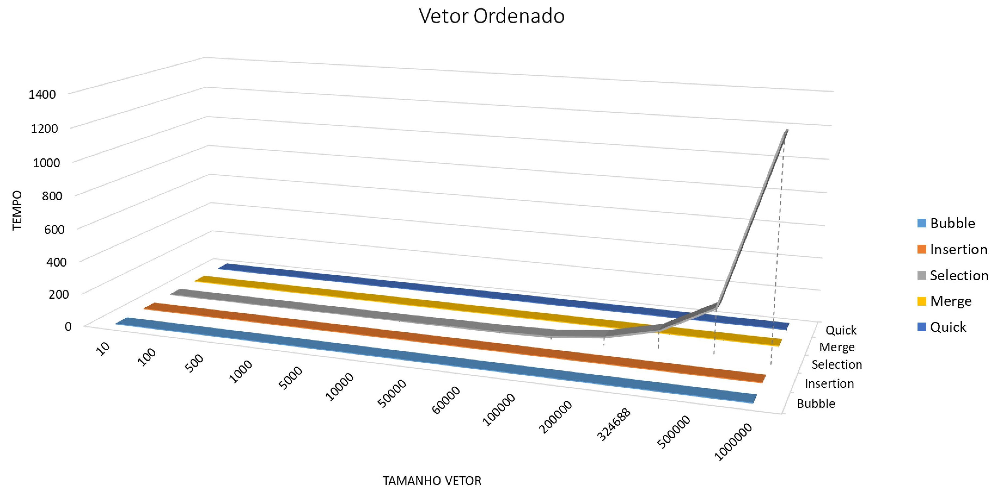
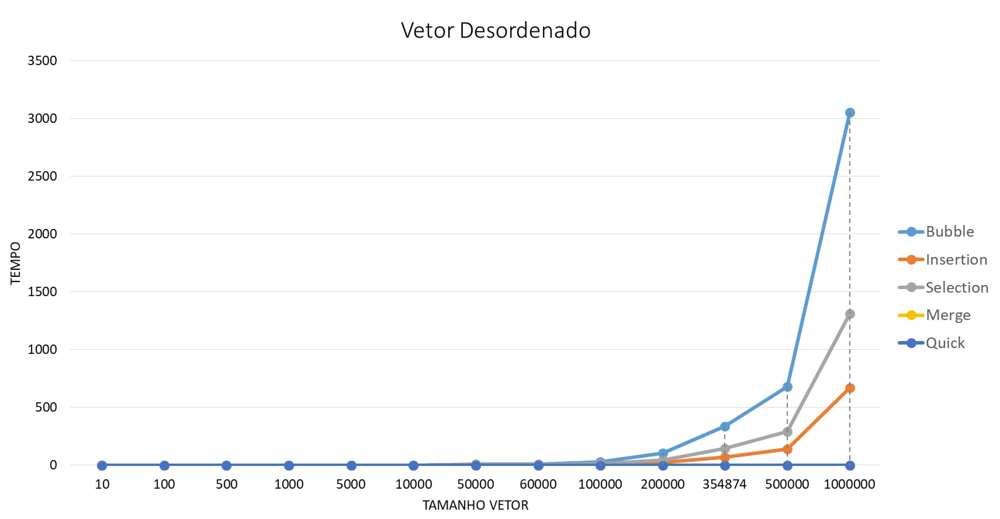
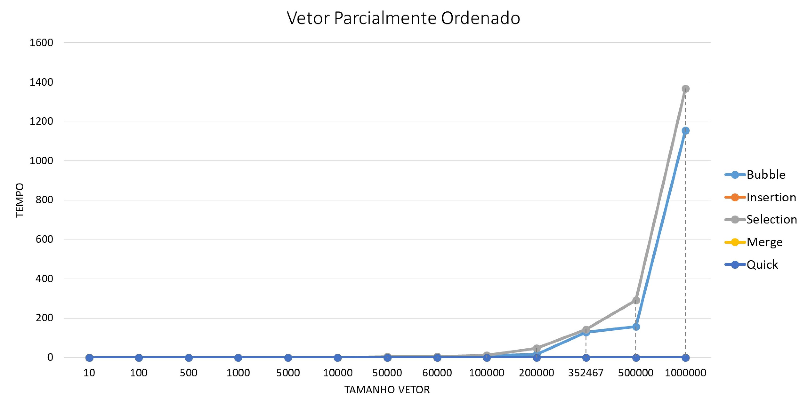

# Algoritmos de Ordenação e Comparação de Tempo x Tamanho

Este trabalho foi feito com o intuito de estudarmos os algoritmos de ordenação em C, sua implementação e sua eficácia em diferentes tipos de vetores, sendo eles:

- Vetor A:
É um vetor totalmente desordenado, com seus valores em posições aleatórias.

- Vetor B:
Um vetor ordenado.

- Vetor C:
Um vetor parcialmente ordenado, com apenas uma elemento fora de posição

Os vetores serão ordenados com os seguintes algoritmos:

- Bubble Sort
- Insertion Sort
- Selection Sort
- Merge Sort
- Quick Sort

## Uso
Para compilar o código, deve-se utilizar: `gcc sorts.c -fopenmp`

Para rodar o código: `./a.out`

O programa solicitará o tamanho dos vetores A, B e C, e logo após aplicará os algoritmos de ordenação em todos os vetores.

Após finalizada a ordenação dos vetores, será gerado um arquivo CSV no mesmo diretório onde o programa foi iniciado, que conterá o tempo de ordenação de cada vetor e para cada algoritmo.

Exemplo:

| "date\-time"        | "type"                     | "length" | "bbs\_time"  | "ins\_time" | "sel\_time"  | "mer\_time" | "qui\_time" |
|---------------------|----------------------------|----------|--------------|-------------|--------------|-------------|-------------|
| "3/6/2020 2:53:55"  | "desordenado"              | 500      | 0\.000436    | 0\.000139   | 0\.000309    | 0\.000097   | 0\.000041   |
| "3/6/2020 2:53:55"  | "ordenado"                 | 500      | 0\.000002    | 0\.000003   | 0\.000336    | 0\.000039   | 0\.000011   |
| "3/6/2020 2:53:55"  | "parcialmente desordenado" | 500      | 0\.000052    | 0\.000002   | 0\.000288    | 0\.000037   | 0\.000011   |
| "8/6/2020 18:41:44" | "desordenado"              | 100000   | 28\.678873   | 6\.854113   | 11\.963376   | 0\.023493   | 0\.014309   |
| "8/6/2020 18:41:44" | "ordenado"                 | 100000   | 0\.000335    | 0\.000368   | 11\.940102   | 0\.015745   | 0\.004897   |
| "8/6/2020 18:41:44" | "parcialmente desordenado" | 100000   | 10\.695253   | 0\.000579   | 11\.924920   | 0\.014523   | 0\.004739   |
| "8/6/2020 21:10:2"  | "desordenado"              | 1000000  | 3054\.296875 | 672\.679321 | 1310\.838501 | 0\.384207   | 0\.154016   |
| "8/6/2020 21:10:2"  | "ordenado"                 | 1000000  | 0\.014954    | 0\.034445   | 1299\.039307 | 0\.191146   | 0\.061240   |
| "8/6/2020 21:10:2"  | "parcialmente desordenado" | 1000000  | 1153\.429688 | 0\.043991   | 1367\.561523 | 0\.203336   | 0\.072653   |

## Gráfico de Comparação Tempo x Tamanho

### Vetor Desordenado

### Vetor Ordenado

### Vetor Parcialmente Ordenado

